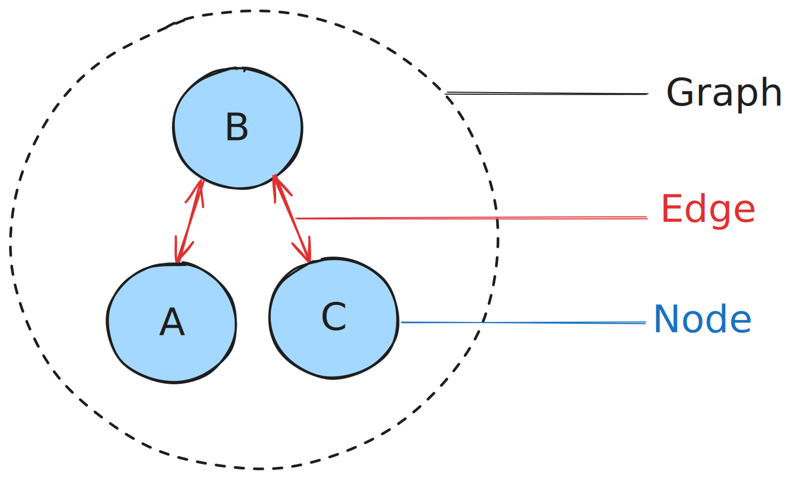
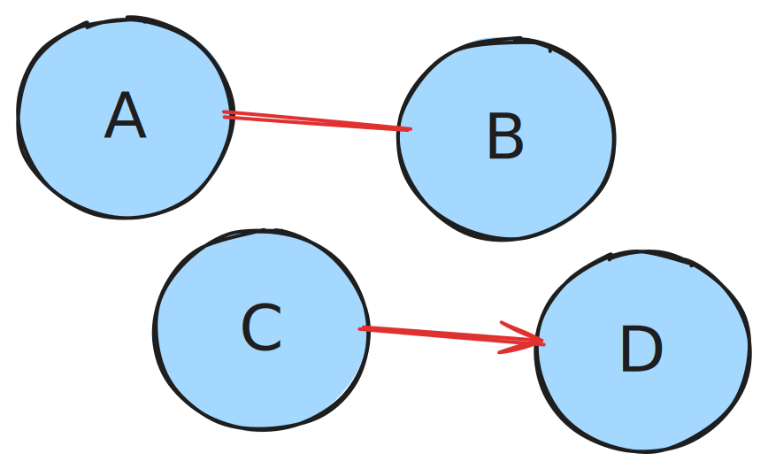
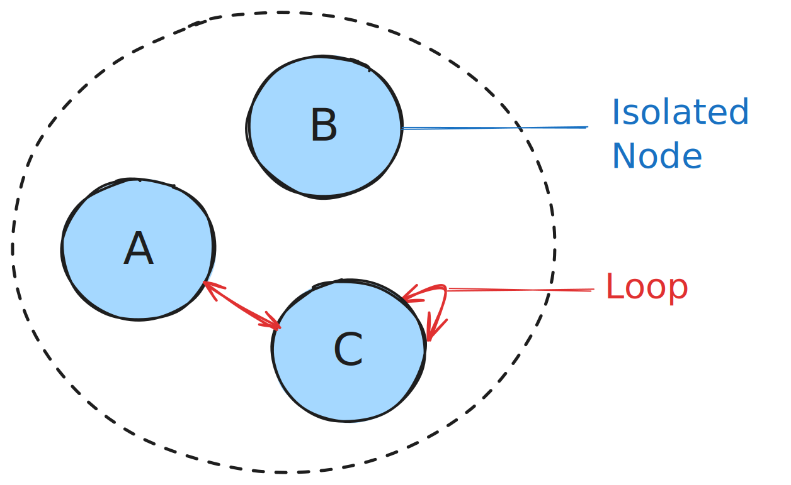
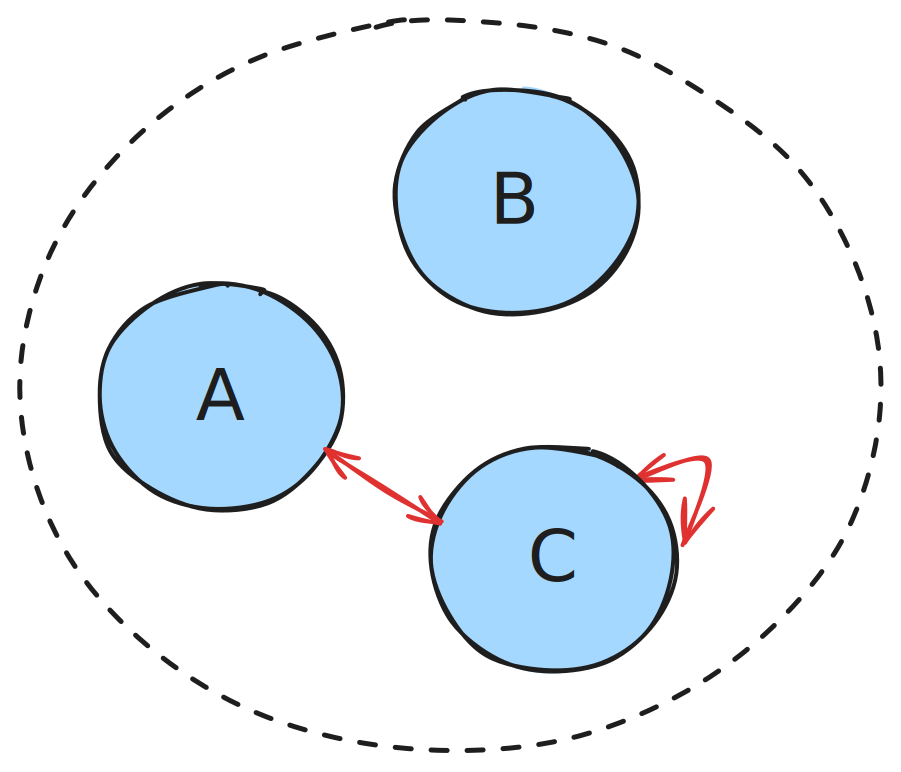
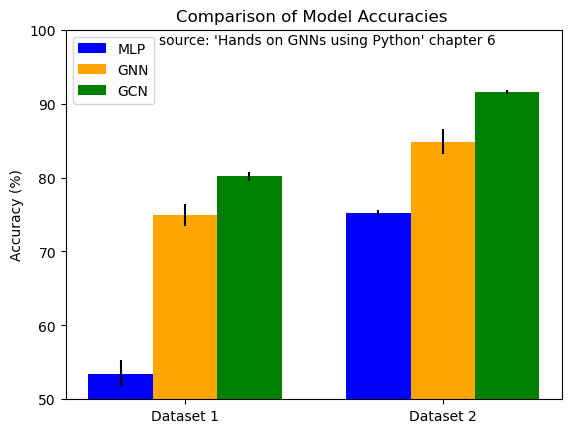
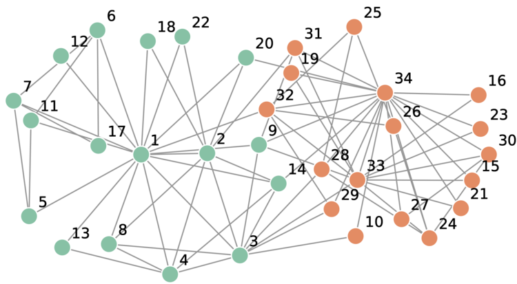

# ~ PoC AI Pool 2024 ~

- ## Day 5: GNNs, NLP, and more

---

One week to learn Deep Learning is absolutely not enough, and while we tried to go as deep as possible and take our time for each subject, the truth is we could dedicate the entire week to just Convolutions or just Reinforcement Learning and we still wouldn't even scratch the surface !

The takeaway is, you should definitely take the time to review each subject by yourself after the Pool, if you're passionate about machine learning !

This field is highly theoretical, so rushing it isn't going to suffice. Our purpose for this Pool is simply to give you a taste of what AI is about and point to which direction you should go if you decide to go **deeper**.

> There wasn't much space left to do a whole module on **Graph Neural Networks** but they are still a very interesting (and trending) subject in Deep Learning that we'd like you to know about, so here's a little introduction to **GNNs** to get you started. Feel free to use this as a starting point for your _Rush_ if you want to !

---

- ### Module 3: Graph Neural Networks

---

#### A. Properties of graph datasets

> Graphs are composed of nodes and the edges between them.

> The edges can be directed or undirected.

> There can be loops (a node having an edge to itself) or isolated nodes (a node having 0 edges).

---

One way to represent the information in graph datasets is by using **adjacency matrices**, or $A$.

The adjacency matrix $A$ for the above graph, for instance, is :

|       | A   | B   | C   |
| ----- | --- | --- | --- |
| **A** | 0   | 1   | 1   |
| **B** | 0   | 0   | 0   |
| **C** | 1   | 0   | 1   |

We might want to know how many neighbours each node has.\
We can use the degree matrix, $D$, which looks like this :

|       | A   | B   | C   |
| ----- | --- | --- | --- |
| **A** | _2_ | 0   | 0   |
| **B** | 0   | _0_ | 0   |
| **C** | 0   | 0   | _2_ |

---

But nodes can also have features, which is what we might want to use to perform classification tasks or solve other problems with graph datasets.

You can find a lot of cool visualisations (some are even interactive) [here](https://distill.pub/2021/gnn-intro/) ! This article (actually, [the entire blog](https://distill.pub/)) is in fact a very good, detailed introduction to GNNs, so feel free to read it in its entirety if you have the time !

---

#### B. Difference between GNNs and regular neural networks

If we only cared about the node's _features_, neural networks on graph datasets would be the same as any regular MLP (multi-layer perceptron, or a regular NN with Linear transformations: $ wx+b $).

What's different between graph - and tabular datasets is the information of which nodes are linked to which other nodes and in what way.

You can draw a parallel to computer vision : you can achieve okay results on MNIST with a simple MLP, but more advanced problems require more specific solutions : which is why we came up with Convolution Neural Networks, which take into account patterns, zones and how which pixels are close to each other. All these informations lead to far better results.

In the same way, GNNs will take into account the edges between the nodes in order to produce more interesting results.

So if the formula for a linear layer without biases is
$$ y = xw $$
You can write the formula for a very basic graph linear layer as
$$ y = Axw $$
With $A$ being the **adjacency matrix** containing the links between all the nodes in the graph.

Simply by modifying the MLP formula and introducing topological information through an adjacency matrix, we can achieve better results and have ourselves a very basic graph neural network.

In [Maxime Labonne's](<(https://mlabonne.github.io/blog/)>) fantastic [book on Graph Neural Networks](https://mlabonne.github.io/blog/book.html) (which we recommend, as it is one of the main sources that helped us write this short introduction to GNNs alongside his [blog](https://mlabonne.github.io/blog/posts/2022_02_20_Graph_Convolution_Network.html) which contain various Jupyter Notebooks on GNNs which we absolutely encourage you to go through), the author draws a comparison between an MLP and this basic implementation of a GNN, by training both models on graph datasets.

The results speak for themselves: `53.47%` accuracy using an MLP compared to `74.98%` for the basic GNN.

#### C. Refining the architecture : Graph Convolutional Network (GCN)

We kept refering to the graph linear layer formula as "_basic_".

The reason for that is it assumes that all nodes have the same number of edges. If one node is neighbour to all nodes in the graph, while the other nodes only have that one core node as their neighbour, the **embedding**, the value obtained for each indiviudal node, would have greater values than the other embeddings.

So by combing our adjacency matrix $A$ which tells us which nodes are connected with our degree matrix $D$ which tells us how many connections each node has, we obtain the following formula for a **GCN** layer (Graph Convolutional Network) :

$$ \~D^{-\frac{1}{2}}\~A^T\~D^{-\frac{1}{2}}XW^T $$

> This might just be the most satanic looking formula you've seen all week (and if you inspect the _LaTeX_ notation for this formula, it's even worse), but I assure you, it's actually really simple :
>
> - Our base formula is $AXW$, right ? An MLP combined with our adjacency matrix to take into account topological information.
> - We want to also take into account the differences in neighbour count between our nodes, so we add the inverse of our degree matrix $D$, $D^{-1}$ to normalize our features.
> - This gives us $D^{-1}AXW$.
> - But adding $D$ at the beginning of our series of matrix multiplications would only normalise each row. So to normalize all features we can use $D^{-\frac{1}{2}}AD^{-\frac{1}{2}}XW$.
> - We've simplified the formulas by removing the $^T$ transpose notation, but because of matrix multiplication rules, we need to take the transposes of these matrices, giving us $ D^{-\frac{1}{2}}A^TD^{-\frac{1}{2}}XW^T $.
> - Now all that's left between us and GCNs is the weird little ~ above our adjacency and degree matrices.
> - So far, by multiplying our data $X$ with our adjacency matrix $A$, we are only looking at our nodes' neighbours, not at the actual nodes themselves.
> - So to add the information of the particular nodes to our architecture, we call $\~A$ the adjacency matrix with the added notion of loops, meaning nodes have edges pointing to themselves, just like node `C` does by default in our earlier representations.
> - This gives us the $ \~D^{-\frac{1}{2}}\~A^T\~D^{-\frac{1}{2}}XW^T $ formula for GCN layers.

For each individual node, the formula for its embedding looks like this :

$$ embedding\ i = \sum{\frac{1}{\sqrt{deg(i)}\sqrt{deg(j)}}}x_jW^T $$

Using the same dataset as earlier to compare the results of basic GNNs with GCNs, the author achieves `80.17%` accuracy compared to the previous `74.98%`. The **standard deviation**, which represents how much the results vary from training to training is also greatly reduced: from more or less `1.50%` to more or less `0.61%` !

---

#### D. Applications of GNNs

There are many applications of GNNs, such as graph-, node- or edge-level classifications. For example, using a dataset such as [Zachary's Karate Club](https://en.wikipedia.org/wiki/Zachary%27s_karate_club) :

This is the MNIST of Graph Neural Networks. A simple, efficient dataset which provides a fantastic introduction to the possibilities of GNNs.\
The dataset represents a social network, each node being a member of a karate club which is separated in two factions.

> You could attempt to classify whether a node belongs to one faction or the other using a GCN in PyTorch !\
> Here's a link to [an article which guides you through this task](https://mlabonne.github.io/blog/posts/2022_02_20_Graph_Convolution_Network.html) but you should also give it a try by yourself first by looking at the official PyTorch Geometric [getting started article](https://pytorch-geometric.readthedocs.io/en/latest/get_started/introduction.html) !

You could also tackle link prediction, which means predicting whether two nodes should be connected or not.

#### E. LightGCN and recommender systems

**LightGCN** is an alternate version of GCN which is used for building recommender systems.
Here's a link to an [implementation of this model](https://github.com/PacktPublishing/Hands-On-Graph-Neural-Networks-Using-Python/blob/main/Chapter17/chapter17.ipynb).

> Try to understand it by looking at other resources you can find on the subject and try to adapt the code in this notebook by using it on another graph dataset, such as [the Movies Dataset](https://www.kaggle.com/datasets/rounakbanik/the-movies-dataset), for example.\
> This task could be really fun if you liked data science and `pandas` : since most of the Deep Learning aspect is already done, you can focus on adapting the model to the new data, and to do that you will need to use some of your **data science** skills to make sure you understand the data and _manipulate_ it to suit your needs !

---

I hope this little write-up was worth reading, and maybe it gave you some ideas for your _Rush_ !

Thank you for getting to the end of this AI Pool, it means a lot ! And I can't wait to see what projects you're able to build this weekend !

> **Remember**: no one appreciates an unfinished mess !\
> You've only been studying AI for a week now, so don't go crazy trying to create GPT 5 : stay humble, build a small, cool project to show off and most importantly, one that you'll be proud of in the future !\
> Or if that's really your thing, go crazy and prove me that one week is all you need to build the project of your dreams !

#### Good luck !
