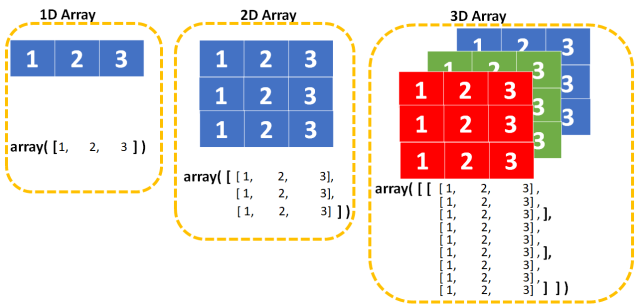

# Module 2 : NumPy & Matplotlib

Welcome to this second module young student, you are now comfortable with Python it is time to enter the world of data science.

In that section we will learn about the NumPy library and the Matplotlib library.

## NumPy

NumPy is a library for the Python programming language, adding support for large, multi-dimensional arrays and matrices, along with a large collection of high-level mathematical functions to operate on these arrays.
It is the fundamental package for scientific computing with Python. A little exemple to illustrate the power of NumPy:



In the image above, we can see that is really easy to create a multi-dimensional matrix, and now, we will see, also why it is also really simple to make operation on this array with numpy.
For example if we want to take the transpose of the array, we just have to do:

```python
import numpy as np

arr = np.array([[1, 2, 3, 3], [4, 5, 2, 8], [7, 8, 9, 13], [10, 11, 12, 15]])
arr = arr.T
```

now if we want to have all number in the diagonal, we just have to do:

```python
arr.diagonal()
```

Those are easy example, but we can do way more, but you will see it in the exercices.

## Matplotlib

Matplotlib is a plotting library for the Python programming language and its numerical mathematics extension NumPy.
It is in fact to show the data that we will manipulate with NumPy, and it is really easy to use, for example if we want to plot a simple graph, we just have to do:

```python
import matplotlib.pyplot as plt

x = [1, 2, 3, 4, 5]
y = [2, 3, 4, 5, 6]

plt.plot(x, y)
plt.show()
```

We just create a line who is based on the fonction y = x + 1, and we can see that it is really simple to do, of course we can do way more,
but you will see it in the exercices.

## Submit 🏆

Fill the notebook: ``numpy_matplotlib.ipynb``

To submit your work, think about pushing your changes. It is important to push so that we are able to assess participation.
If you have any concerns, talk to a supervisor.

## Resources :book:

- [Doc NumPy](https://numpy.org/doc/stable/)
- [Doc Matplotlib](https://matplotlib.org/stable/contents.html)
