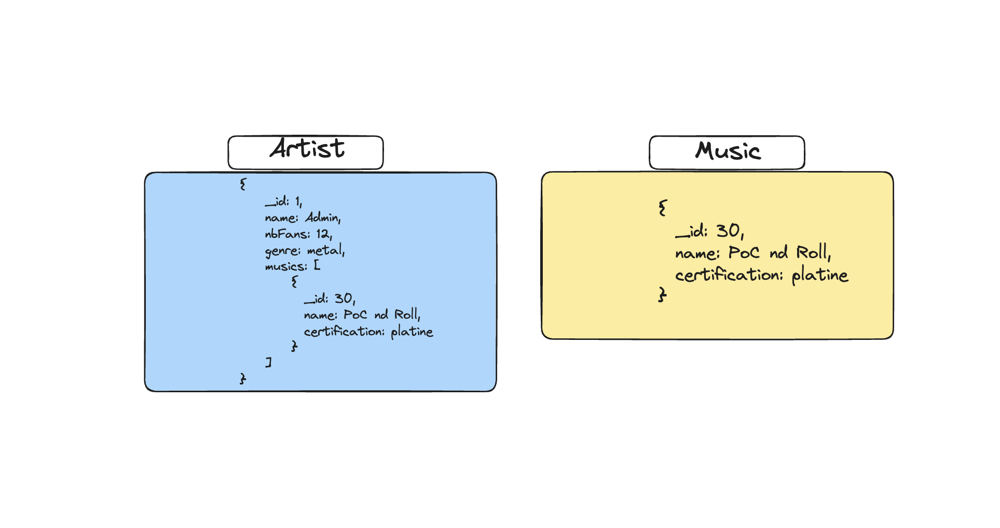
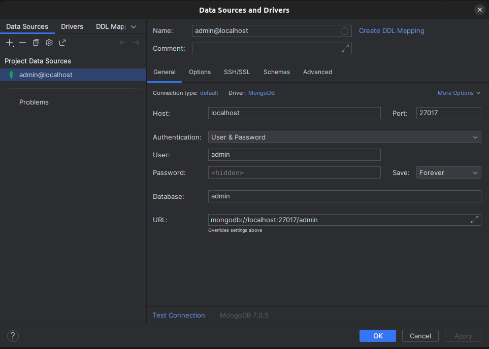
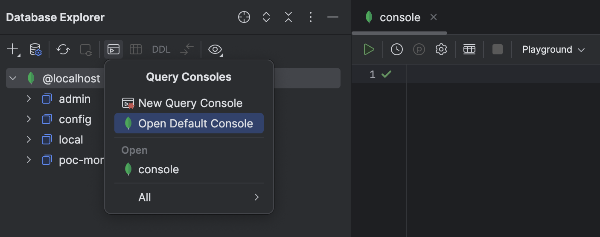
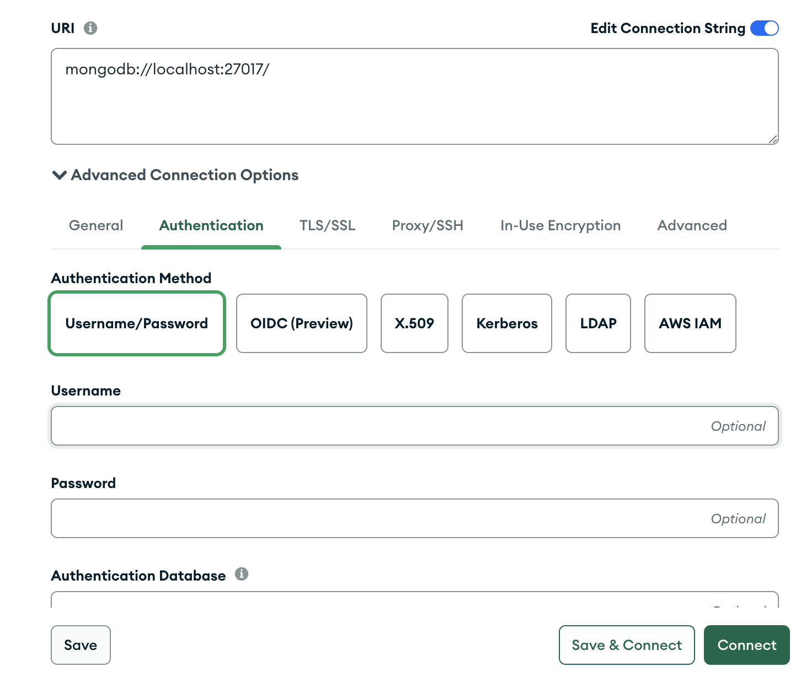

# PoC Software Pool 2024 - Day 02 - noSQL

**Day purposes**

✔️ Perform basic NoSQL queries, emphasizing MongoDB as a practical example.

✔️ Explore NoSQL database management tools.

✔️ Grasp the fundamentals of NoSQL databases, with a focus on MongoDB.

## Introduction

> 💡 This step is designed exclusively for participants who have successfully completed the SQL workshop earlier today. Please note that it is not necessary to proceed with the NoSQL workshop if you plan to attend the ORM session in the afternoon. The NoSQL workshop is entirely optional, and the ORM workshop that follows is considered more essential for the overall learning progression.

During the [day 01](../../day01), you learned a programming language to 
develop software. But a software isn't only composed of a hundred thousand
lines of code, it's common to use external tools to take in charge a specific
task. 😉<br>
For example, you can use [Prometheus](https://prometheus.io)/[Grafana](https://grafana.com) to monitor your app, [Kafka](https://kafka.apache.org) as a queue or a [database](https://en.wikipedia.org/wiki/Database) to store huge amount of data...

### What's a database?

It's an organized space where you can store pieces of information.
Each time you need a permanent storage, for example, to store users, you will
need a database.<br>
It has many usage and ways, the most popular is [SQL database](https://en.wikipedia.org/wiki/SQL) or 
also called [relational database](https://en.wikipedia.org/wiki/Relational_database). However, today, we will delve into the world of [NoSQL databases](https://en.wikipedia.org/wiki/NoSQL), and more specifically, [document databases](https://en.wikipedia.org/wiki/Document-oriented_database) like [MongoDB](https://en.wikipedia.org/wiki/MongoDB).

Let's dive into the exciting world of NoSQL databases! 🚀

### Type of database

Today we will learn document database but other exists:

- [Relational](https://en.wikipedia.org/wiki/Relational_database)
- [Graph](https://en.wikipedia.org/wiki/Graph_database)
- [Column](https://en.wikipedia.org/wiki/Column-oriented_DBMS)
- [Key/Value](https://en.wikipedia.org/wiki/Key–value_database)
- [Search Engine](https://en.wikipedia.org/wiki/Database_search_engine)
- [Multi model](https://en.wikipedia.org/wiki/Multi-model_database)

> You can find more information about databases in this [post](https://fireship.io/lessons/top-seven-database-paradigms/) 😄

## Requirements

There are many tools to manage a database. We give you the choice between
[DataGrip](https://www.jetbrains.com/datagrip/) and [Compass IDE](https://www.mongodb.com/products/tools/compass).

> We recommend DataGrip for its powerful UX and easy adoption 😉

In the folder [resources](./resources), you will find a file named 
[database.json](./resources/database.json) to get the data that we will generate in ou new database with artists and musics.

Here's a schema of our data:


In document databases, data is stored into a [document](https://www.mongodb.com/docs/manual/core/document/) where each information is stored in an object as a [field-and-value](https://www.mongodb.com/docs/manual/core/document/).

You won't be using traditional relations as in a relational database, where you create [relationships](https://hasura.io/learn/database/postgresql/core-concepts/6-postgresql-relationships/) between tables 😄. Instead, in a document database, you have the flexibility to either [embed](https://www.mongodb.com/basics/embedded-mongodb) related data directly within a document or use [references](https://www.mongodb.com/docs/manual/reference/database-references/) to establish connections between documents.

> 💡 You can find more information about MongoDB concepts [here](https://www.mongodb.com/basics).

> These concepts are important, if you are lost don't hesitate to ask the staff for help they'll be happy to help you understand 😜

### DataGrip

> If you don't want to use DataGrip, move to the [Compass IDE](#compass-ide) setup.

First, download DataGrip using the [Jetbrains Toolbox](https://www.jetbrains.com/toolbox-app/).

You can use [docker](https://www.docker.com) to run a [MongoDB](https://www.mongodb.com/) 
database and [npm](https://www.npmjs.com/) or [yarn](https://yarnpkg.com/) to run the script to fill the documents

```shell
docker run -d \
  --name poc-mongo-db \
  -p 27017:27017 \
  -e MONGO_INITDB_ROOT_USERNAME=admin \
  -e MONGO_INITDB_ROOT_PASSWORD=pass \
  -v db:/var/lib/mongodb/data \
  mongo:latest
```

Go to the [resources](./resources) folder and execute the [setup.sh](./resources/setup.sh) bash script.

```shell
cd resources
chmod +x setup.sh
./setup.sh
docker exec -it poc-mongo-db mongosh --username admin --password pass
```

> If you can't manage to connect to your database, try changing the **MONGO_INITDB_ROOT_USERNAME** parameter to something else and reloading your container using ``docker rm``.

> Don't worry about this command for now, you will learn docker during day04 👀

Start DataGrip and create a new `Data Source` of type `MongoDB`.

Before entering the information chose the authentication method `User & Password`
<br>
Here's the information to fill in the form:
- Database name: `admin`
- Username: `admin`
- Password: `pass`
- Host: `localhost`
- Port: `27017`

> 💡 You will certainly have to download the MongoDB driver on your first connection.

Below you have an example of configuration:



After applying the configuration, you should see a new data source in the left panel of DataGrip.

Verify that you have something similar to the example below:


To execute your commands go into the terminal logo and select the `Open Default Console` so you can execute your firsts commands! 😎 As you can see once you write a command you can click on the gree  ⏯️ button.



> You can look a [these steps](https://www.jetbrains.com/help/datagrip/mongodb.html)
> if you encounter an issue during the configuration.

### Compass IDE

> This is a official IDE by MongoDB for MongoDB

- Go to [MongoDB Compass](https://www.mongodb.com/try/download/compass).
- Click on `Platform` and select your distribution (Ubuntu, Fedora, ...).
- Click on `Download`.
- Go to your `Downloads/` folder.
- Execute this command: <br>
    ```sudo dpkg -i mongodb-compass_1.41.0_amd64.deb```
- Open compass from you applications

You should get the following result


Go to `Advanced Connection Options` and you should fill the `username` and the `password` with **admin** and **pass**



> ✅ To execute mongoDB commands in compass you can click the the `mongosh icon` on the bottom of the page and you will get a terminal.

## Step 0 - Setup
### 📑 Description:
If you correctly followed the requirements, you should have a database
ready to use 😍

### 📌 Tasks:
If your are here it means you finished the SQL part bofore the ORM part starts, 🥳 congratulations.

First of all create a noSQL folder in your `day02` directory 
```shell
mkdir -p day02/noSQL
```

Create a file `queries.md` in which you will write every query you make to keep a trace:
```shell
touch queries.md
```

## Step 1 - Basics
### 📑 Description:
Your database is ready to run your first requests 🥳

The goal of this step is to understand how to read data in a database using
[mongosh](https://www.mongodb.com/docs/mongodb-shell/).

Let's try to get some information from the collection `artists`.

### 📌 Tasks:
Write 4 queries to :
- List all the avaiable DB's and switch to your poc-mongo-db
- Retrieve **all** the information contained in the `artists` collection.
- Retrieve **only** `name` and `genre` from the collection `artists`.
- Retrieve the list of all `artists` of `genre` `hip-hop/rap`.

### 📚 Documentation:
> See how to [read data with mongosh](https://www.mongodb.com/docs/mongodb-shell/crud/read/).

## Step 2 - Relations in noSQL?
### 📑 Description:
In a relational database, you store each individual entity in its own table, and link them together through foreign keys. While MongoDB certainly supports references from one document to another, and even multi-document joins, it’s a mistake to use a document database the same way you use a relational one.

### 📌 Tasks:
Let's write 3 new queries to link information from collections:
- Retrieve `name` from `artists` and `musics`.<br>
You must specify the name of your result field with `artists_names` and `musics_names`.
- Retrieve all `artist` who singed in the music `We Are The World`.<br>
Those artists must be sorted in `descending` order according to their number of fans.
- Retrieve all the `musics` from `Booba`.<br>
They must be sorted in `alphabetical` order.

### 📚 Documentation:
> - See [how to sort data](https://www.mongodb.com/docs/manual/reference/operator/aggregation/sort/)
> and [aggregation stages](https://www.mongodb.com/docs/manual/reference/operator/aggregation-pipeline/) .
<br>
> - An article about which method you should use to manage "relations" in a noSQL database, each one has pros and cons, [embed or references](https://www.reddit.com/r/mongodb/comments/nag9yd/references_vs_embedding/)


## Step 3 - CRUD
### 📑 Description:
Yesterday, you programmed the CRUD of a resource, let's learn how to do it using noSQL 💪

### 📌 Tasks:
Write queries to:
- Add a new `artist` with his `id` set to `100`.
- Delete all musics that have the `Gold` `certification`.
- Add the music `Take What You Want` to the `artists` you previously created.

### 📚 Documentation:
> - See how [create](https://www.mongodb.com/docs/manual/reference/method/db.collection.insert/) or 
> [delete](https://www.mongodb.com/docs/manual/tutorial/remove-documents/) with in mongosh.
> -  Did you know that you can [create an use variables](https://copyprogramming.com/howto/how-to-use-variables-in-mongodb-query?utm_content=cmp-true) like in JavaScript?

## Step 4 - Good counts make good friends
### 📑 Description:
You've learned the basics, let's see more advanced features with mongosh functions.

### 📚 Documentation
You will use oprations to [count elements](https://www.mongodb.com/docs/manual/reference/method/db.collection.count/) in your collections.

> 💡 Databases are faster than any programming language (except C) so if you can pre-process your data in your query, do it.

### 📌 Tasks:
Write 4 new queries to:
- Count the number of `artists`
- Count the number of `artists` in each `genre`.
- Count the number of `musics` sorted by their certification and displayed in ascending order.

## To go further

Congratulation, you now have solid knowledge in SQL and noSQL 🎉

Here are some links for the most courageous among you:

- [Use Indexing for Performance Optimization](https://www.couchbase.com/blog/query-optimization-in-nosql-couchbase-mongodb/)
- [MongoDB Aggregation Pipeline Queries vs SQL Queries](https://www.mongodb.com/developer/products/mongodb/sql-to-aggregation-pipeline/)
- [Implement Caching Strategies](https://www.dragonflydb.io/faq/how-to-implement-in-memory-caching-with-mongodb)

<h2 align=center>
Organization
</h2>
<br/>
<p align='center'>
    <a href="https://www.linkedin.com/company/pocinnovation/mycompany/">
        
    </a>
    <a href="https://www.instagram.com/pocinnovation/">
        
    </a>
    <a href="https://twitter.com/PoCInnovation">
        
    </a>
    <a href="https://discord.com/invite/Yqq2ADGDS7">
        
    </a>
</p>
<p align=center>
    <a href="https://www.poc-innovation.fr/">
        
    </a>
</p>

> 🚀 Don't hesitate to follow us on our different networks, and put a star 🌟 on `PoC's` repositories.
