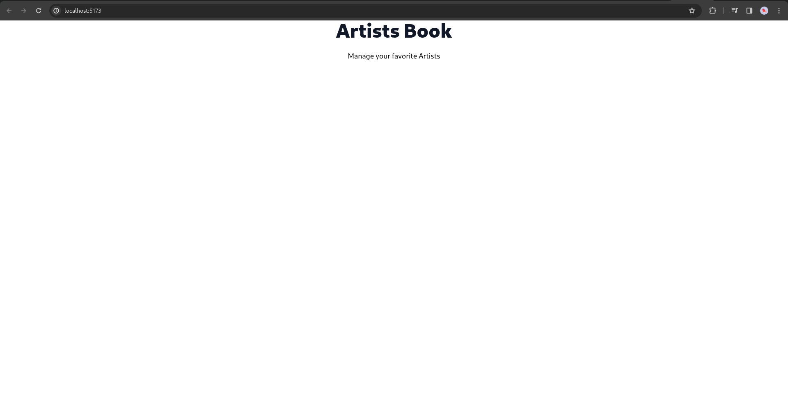
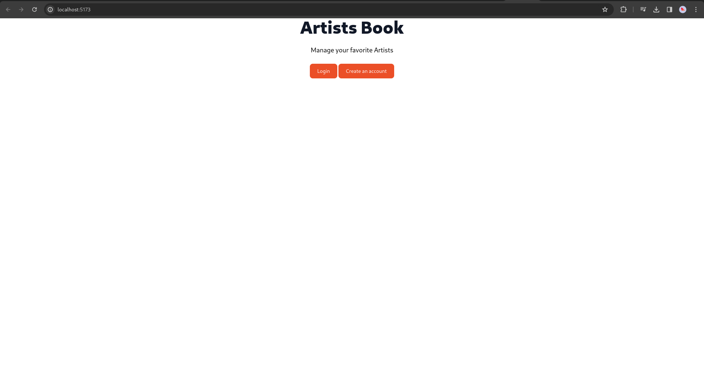
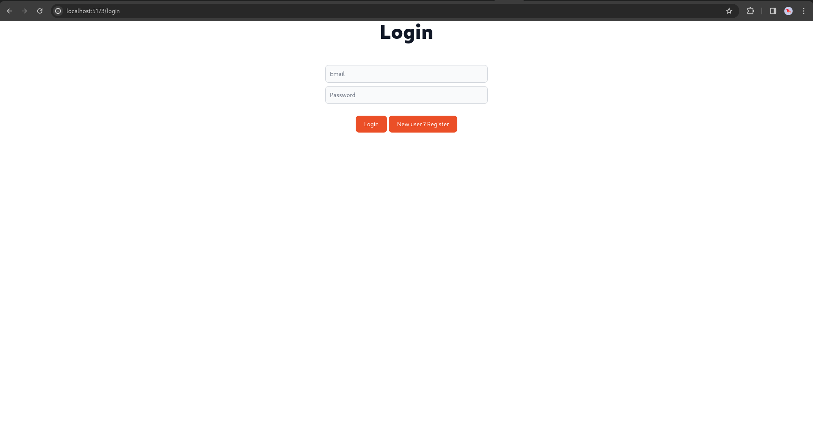
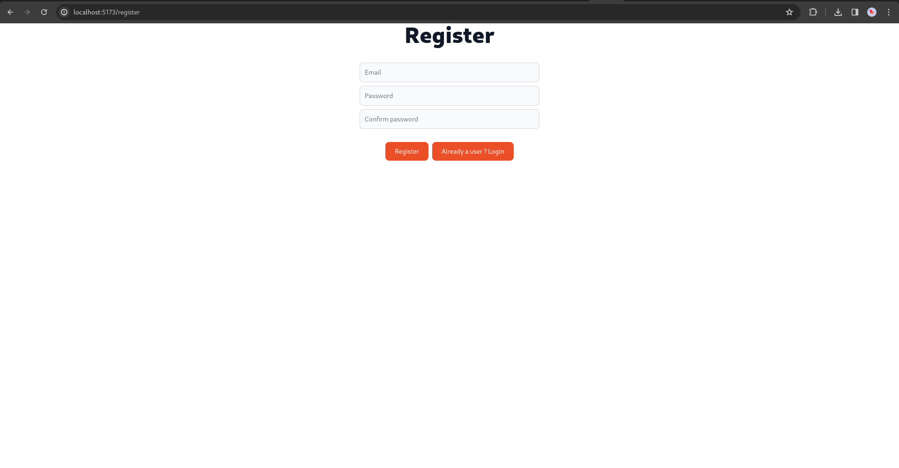
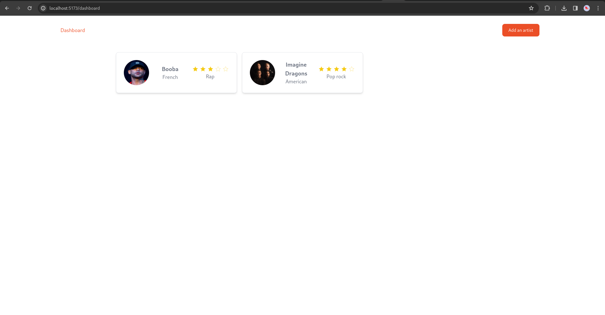
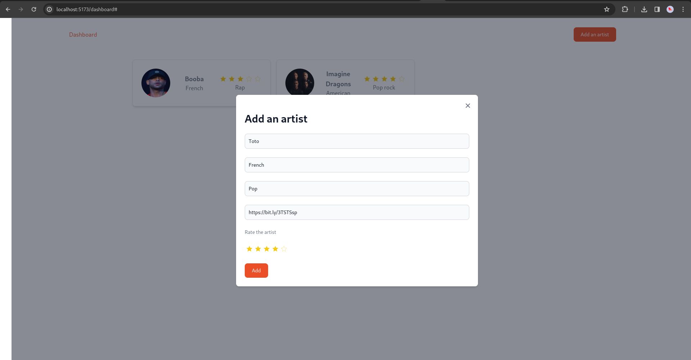

# PoC Software Pool 2023 - Day 05 - Sv

**Day purposes**

✔ Create your own User Interface (UI) with Svelte and Flowbite Svelte ✨

✔ Structure your UI 🚧

✔ Test your UI 🧑‍💻

## Introduction

*[Svelte](https://svelte.dev/) is a Javascript library to build user interfaces.*

**What is a user interface?**

A user interface (UI) is the point at which humans interact with a computer, a website or an application. 💻

For instance, your terminal is a user interface.

**What does this Javascript library allow us to do?**

Thanks to Svelte, you can build [components](https://svelte.dev/docs/svelte-components). A component is a Javascript function that returns a Javascript object representing a DOM element in memory.

> 💡 DOM stands for Document Object Model, which is the HTML representation of a web page. As a consequence, a DOM element is a part of the HTML representation of a web page.

However, unlike [React](https://en.reactjs.org/), Svelte doesn't rely on a virtual DOM to update the actual DOM. Instead, it compiles your components into optimized Javascript code. This approach makes the rendering of your app more efficient. 🚀

> The real DOM is the HTML representation of the web page that the user sees. It's updated by [queries](https://burlingtoncodeacademy.github.io/webdev-prework-track/DOM_queries). The virtual DOM is a copy of the real DOM.

<div align="center">

</div>

## Step 0 - Setup

In your pool repository, create a new directory for the `day05`:

```sh
mkdir -p day05
```

Then, create a new Svelte project with Typescript:

```shell
npm create vite@latest artists-book -- --template svelte-ts
```

To verify that everything is ok, run the following commands:

```shell
# Move to your project
cd artists-book

# Install the required dependencies
npm install

# Start the server
npm run dev
```

If you get a page with the Vite and the Svelte logos, then you can continue 🚀

## Step 1 - Lay the foundations

Before starting the tasks, let's prepare your project.

Install all the packages we're going to use for this day:

```sh
npm i svelte-routing cypress flowbite flowbite-svelte
```

You'll build your UI with [Flowbite Svelte](https://flowbite-svelte.com/), which is a component library for Svelte.

Now that the foundations are laid for your project, it's time to dive into frontend development 🏊

## Step 2 - Your first component 🚀

### :bookmark_tabs: **Description**:

Let's start by creating the Home page 😄 

### :pushpin: **Tasks**:
- Create the file `src/pages/Home.svelte` with a Svelte component representing your Home page inside.
  It must contain:
  - a title `Artists Book` 🧑‍🎤
  - a subtitle `Manage your favorite artists` ⭐
- Update the file `src/app/App.tsx` to call this component.

> Remove the initial content of ```src/App.svelte``` to start off fresh.

### :books: **Documentation**:
- Check [what a Svelte component is made of](https://svelte.dev/docs/svelte-components) 👀
- Take a look up at the [Heading](https://flowbite-svelte.com/docs/typography/heading) component in Flowbite Svelte 😉

### ✔️ **Validation**:


Well done! You have created your first Svelte Component 🥳

> 💡 A **great idea** is to create a folder `src/components` to store reusable components.

## Step 3 - Your first routes 🛤️

### :bookmark_tabs: **Description**:
Now that you have your Home page, it's time to have Register and Login pages reachable at the `/register` and `/login` URLs 😉

### :pushpin: **Tasks**:
- Create the `src/pages/Register.svelte` file, which will contain the Register page.
It must contain:
  - An `Input` to enter an `email`.
  - An `Input` to enter a `password`.
  - An `Input` to enter the `confirmed password`.
    > 💡 Text for the password inputs mut be replace by dots
  - A `Button` that when clicked, log the values of the email, the password and the confirmed password.

- Create the `src/pages/Login.svelte` file, which will contain the Login page.
  - An `Input` to enter an `email`.
  - An `Input` to enter a `password` with text replaced by dots again.
  - A `Button` that when clicked, log the values of the email and the password.
  - A `Button` to the Register page.

- Create the `src/app/Routes.svelte` file, with a Svelte component containing the Routes inside, called in `src/App.svelte`.

- Finally, update the home page, by adding:
  - A `Button` to the Register page.
  - And a `Button` to the Login page.

### :books: **Documentation**:
- Have a look at the Flowbite Svelte [Button](https://flowbite-svelte.com/docs/components/buttons) and [Input](https://flowbite-svelte.com/docs/components/forms#mainContent) components. 
- Take also a look at the [svelte-routing](https://github.com/remix-run/react-router/blob/main/docs/start/tutorial.md) package.
- As well, check out what [binding](https://svelte.dev/docs/element-directives#bind-property) is in Svelte (that might be useful for the inputs  👀)

### ✔️ **Validation**:

*The home page.* 🏠


*The login page.*


*The register page.*

## Step 4 - Testing time 🧪

### :bookmark_tabs: **Description**:
Great, you now have a nice UI, but how do you make sure it works well without manually testing?

A great tool for front-end testing is [Cypress](https://www.cypress.io/), mainly used for [end-to-end](https://css-tricks.com/front-end-testing-is-for-everyone/#h-end-to-end-e2e-testing) and [component](https://docs.cypress.io/guides/component-testing/overview) tests.

To win time, we already created some tests for you, you'll just need to adapt them to your application 😄

Since we've installed Cypress earlier, you can just add the necessary scripts in the `package.json`:
```json
"cypress:run": "cypress run",
"cypress:open": "cypress open",
```
> You can run the tests directly in the CLI or open an UI to do so 😉

Once this is done, [extract the given files](). You should have a `cypress` folder at the root of your project with the test files located in `cypress/e2e`, and a `cypress.config.ts` file also at the root.
> 💡 You'll notice the `cypress/videos` and `cypress/screenshots` folders, when you run the tests cypress will fill these directories with content to help you debug your tests if they fail. You can add them to your `.gitignore` to avoid committing them. 

Lastly, you will need to add some [`id`](https://developer.mozilla.org/en-US/docs/Web/HTML/Global_attributes/id?retiredLocale=id) to the components of your UI. They will be useful to find content of your UI, especially here for the cypress tests. 

For example in `home.cy.ts`, you have this test for the title where we find the UI content based on the `app-title` id:
```ts
it('Good title', () => {
  cy.get('#app-title').should('contain', 'Artists Book');
});
```

When you're done, you can use `npm run cypress:run` and admire the passing tests 🚀

> During the next steps, feel free to add tests for the new components and pages you create 😉

## Step 5 - Your first dashboard 📋

### :bookmark_tabs: **Description**:
Now that you have solid foundations, it's time to go further 🔥

You have a Home page, a Register page and a Login page. What's missing? A Dashboard page!

Let's now play with artists 🚀

> 💡 To see what is an `Artist`, check the [API doc](https://github.com/PoCInnovation/Pool2023/blob/main/Software/day05/resources/README.md)

### :pushpin: **Tasks**:

- Create the `src/pages/Dashboard.svelte`. It will conatin the Dashboard page listing some artists, with the `/dashboard` URL.
  The Dashboard page must contains:
  - A `Navbar` in the top with:
    - A `Link` to the Dashboard page on the left.
    - A `Button` `Add an Artist` on the right, **doing nothing for now**.
  - A `Gallery` listing artists's `card`.

> ⚠️ For now, data is stored within the component. There is no real database and no interaction with the API.

- Update the Register `Button` to redirect to the Dashboard page when clicked.
- Update the Login `Button` to redirect to the Dashboard page when clicked.
- Add the following files:
    - `src/types/Artist.svelte` with the `Artist` type inside. Be smart, take only the needed properties 😎
    - `src/components/Bar/TopBar.tsx` with the top `Navbar` inside.
    - `src/components/Button/AddArtistButton.tsx` with the `Add an Artist` `Button` inside.
    - `src/components/Card/ArtistCard.tsx` with the artists's `card` inside, displaying every information about an artist except from his `id`.
    > Try to display the `rating` using 5 stars ⭐

### :books: **Documentation**:
- The Flowbite Svelte [Gallery](https://flowbite-svelte.com/docs/components/gallery#mainContent), [Navbar](https://flowbite-svelte.com/docs/components/navbar), [Link](https://flowbite-svelte.com/docs/typography/link]) and [Rating](https://flowbite-svelte.com/docs/components/rating) components will be useful for this dashboard 😉

### ✔️ **Validation**:

*The Dashboard page.*

## Step 6 - Become a true Frontend Developer 📈

### :bookmark_tabs: **Description**:
Now that you can list artists, what if you could add some?

As you can notice, your `Add an artist` button does nothing for now.

Let's add artists in a cool way 😎: when this button is clicked, a `Modal` appears with a form to create an artist.

### :pushpin: **Tasks**:
- You must create the file `src/components/Modal/AddArtistModal.svelte` with the `Modal` to add an artist inside, called in `src/components/Button/AddArtistButton.svelte`

### :books: **Documentation**:
- Flowbite Svelte has a component perfectly fit for this use case: the [Modal](https://flowbite-svelte.com/docs/components/modal#mainContent) 🔥

### ✔️ **Validation**:

*Modal to add an artist.*

***
### **⚠️ Important note ⚠️**

First, well done! You've worked hard to be here 👏

It's time to give you a gift: an advice 🎁

One of the most difficult thing when you build a User Interface with React (and other libraries of components / frameworks) is to manage the dozens of components you create.

But why is it difficult?

It's because your components are not **stateless**. ***There is logic inside them***. For instance, sometimes you will copy-paste a whole component, just to change a condition, a function...

It's really difficult to build components that you can re-use in different parts of your project.

So how can you resolve this problem?

One of the best thing to do is to build ***stateless components***.

Keep your logic, your function calling APIs... the higher in your tree component. Pass functions, conditions... ***as parameters*** to your components.

It might not seem important right now, but it will help you so much.

To set this up, here is a little challenge you can take: all your logic, keep it inside the pages components, and only there.

If you want to go further in frontend development, follow this principle as much as you can 😉
***

<h2 align=center>
Organization
</h2>
<br/>
<p align='center'>
    <a href="https://www.linkedin.com/company/pocinnovation/mycompany/">
        
    </a>
    <a href="https://www.instagram.com/pocinnovation/">
        
    </a>
    <a href="https://twitter.com/PoCInnovation">
        
    </a>
    <a href="https://discord.com/invite/Yqq2ADGDS7">
        
    </a>
</p>
<p align=center>
    <a href="https://www.poc-innovation.fr/">
        
    </a>
</p>

> 🚀 Don't hesitate to follow us on our different networks, and put a star 🌟 on `PoC's` repositories.
